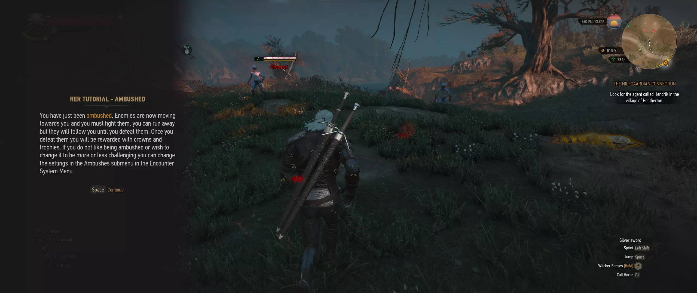
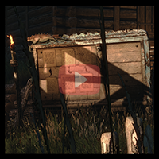
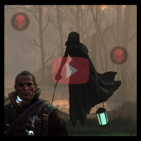
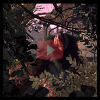

# Random Encounters Reworked

  
<a href="https://www.youtube.com/watch?v=p8T9XQW95pg">contracts</a> ---------------------- <a href="https://www.youtube.com/watch?v=BxBP95s">bounties</a> ---------------------- <a href="https://www.youtube.com/watch?v=5uWC3I-crjI">events</a>

  
  
  
 

 
 
 - Randomly generated monster contracts, monster hunts, and monster ambushes
 - Custom monster trophies to provide Geralt coins for his hunts
 - Ecosystem simulation with a unique food chain
 - Events that react to your actions, fight noise attracts creatures, blood and corpses attract necrophages
 - New unique spawn points all over the world and for any kind of creature
 - Perfect performances, no FPS drop on an encounter
 - Complete mod menu to change anything you want
 
 # Installing
 ## Written guides
 - [The quick guide (install script)](https://aelto.github.io/tw3-random-encounters-reworked/#install)
 - [The in-depth guide](https://aelto.github.io/tw3-random-encounters-reworked/indepth-guide/)
 - [Old-gen guide](https://aelto.github.io/tw3-random-encounters-reworked/indepth-guide/oldgen.html)
  
## Video guides 
 - [Vanilla Next-Gen](https://www.youtube.com/watch?v=ICNbUVmycbs)
 - [W3EER Next-Gen ](https://www.youtube.com/watch?v=R148q8_k2NQ)
 - [Vanilla Old-Gen](https://www.youtube.com/watch?v=QBLdV3T2IKs)

# Uninstalling
 - [The in-depth guide](https://aelto.github.io/tw3-random-encounters-reworked/indepth-guide/#part-7)

# Questions?
If you have questions about the mod, what it offers and how to tweak the settings, the [Random Encounters Reworked Bible](https://aelto.github.io/tw3-random-encounters-reworked/rer-bible/) was made for that

# Contributing
## To the mod itself
I would gladly accept PRs for Random Encounters Reworked. If you have suggestions or ideas you would like to implement yourself please submit an issue or a PR so we can discuss about it (to ensure it follows the vision i have for the mod) then feel free to submit code.

 - The mod's source code is now written in the `cahirc` language, [a homemade language](https://github.com/Aelto/tw3-cahirc-language) i made myself to make our lives easier. In general, most vanilla witcherscript you could write will successfuly compile with `cahirc` as well. Read its documentation for more information.
 - The source code for the mod is in `/src`
 - Various utility scripts can be found in the `scripts` folder, for example a simple `install` script to quickly drop all the source code into the mods folder in your game.
 - Most of the edits in the vanilla code are in the form of shared utilities, which can be found at a different repository: [`tw3-sharedutils`](https://github.com/Aelto/tw3-shared-utils). This helps ensure the vanilla edits RER introduces are kept to a minimum and are well thought.

## Add-ons
If you wish to make an add-on for the mod to modify its behaviour at runtime,
please refer to the [addons documentation](/docs/guides/addons.md)
